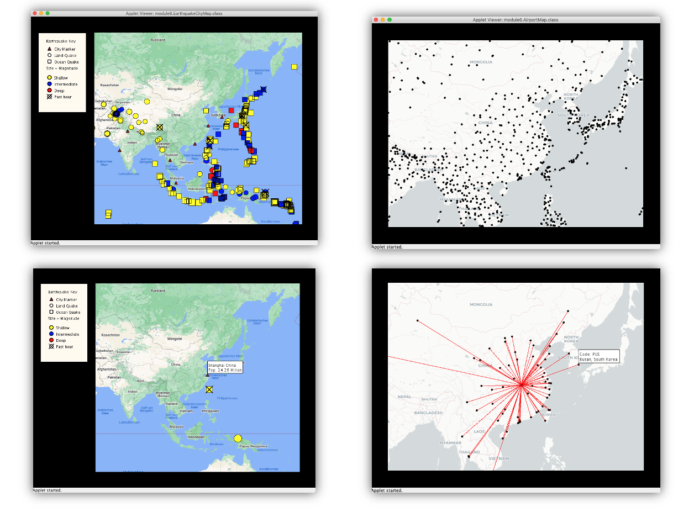

Data Visulization Maps 
==================================================================

Final project for the Object Oriented Programming in Java course offered by 
UC San Diego through Coursera. The final project is contianed in the module 6.

Two data visualization maps are built: one map (left) visualizes the earthquakes around the world and one map (right) visualizes the airports their routes. Both maps are interactive. Users can hoove over or click the markers to get more information.

